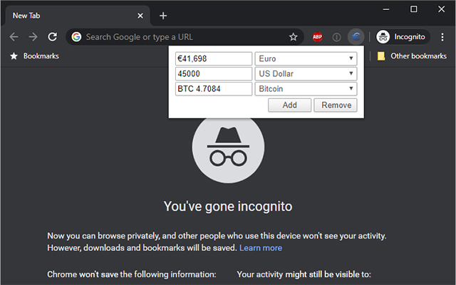

# Minimal Currency Converter

[-brightgreen)](https://chromewebstore.google.com/detail/minimal-currency-converte/meekoegodidgjomlhheckddffabnajpa/reviews)

A Chrome extension for converting multiple currencies with **real-time exchange rates** and a **minimalistic user interface**.

Powered by real-time data from the **European Central Bank** and **CoinGecko**, the extension lets you effortlessly swap between dozens of world currencies — and even Bitcoin, Ethereum and other cryptocurrencies — right from your browser.

  

## ✨ Features

- **Real-time exchange rates** — rates are refreshed automatically every 15 minutes.
- **Convert many currencies at once** — add up to **15** currency rows and see them all update simultaneously.
- **38 currencies supported** — 33 fiat currencies plus 5 cryptocurrencies.
- **Sleek, minimal design** — a clean, intuitive interface that stays out of your way.
- **Privacy-friendly** — only the `storage` permission is requested and **no personal data is collected**.
- **Remembers your setup** — your selected currencies and last entered value are saved locally.
- **Open source** — fully transparent and available on GitHub.

## 💱 Data sources

| Type | Source |
| --- | --- |
| Fiat currencies | European Central Bank rates, served via the project's [`data/rates.json`](data/rates.json) |
| Cryptocurrencies | [CoinGecko API](https://www.coingecko.com/en/api) |

## 🌍 Supported currencies

### Fiat (33)

| Code | Currency | Code | Currency | Code | Currency |
| --- | --- | --- | --- | --- | --- |
| USD | US Dollar | EUR | Euro | JPY | Japanese Yen |
| BGN | Bulgarian Lev | CZK | Czech Koruna | DKK | Danish Krone |
| GBP | Pound Sterling | HUF | Hungarian Forint | PLN | Polish Zloty |
| RON | Romanian Leu | SEK | Swedish Krona | CHF | Swiss Franc |
| ISK | Icelandic Krona | NOK | Norwegian Krone | HRK | Croatian Kuna |
| RUB | Russian Rouble | TRY | Turkish Lira | AUD | Australian Dollar |
| BRL | Brazilian Real | CAD | Canadian Dollar | CNY | Chinese Yuan |
| HKD | Hong Kong Dollar | IDR | Indonesian Rupiah | ILS | Israeli Shekel |
| INR | Indian Rupee | KRW | South Korean Won | MXN | Mexican Peso |
| MYR | Malaysian Ringgit | NZD | New Zealand Dollar | PHP | Philippine Peso |
| SGD | Singapore Dollar | THB | Thai Baht | ZAR | South African Rand |

### Cryptocurrencies (5)

| Code | Currency |
| --- | --- |
| BTC | Bitcoin |
| ETH | Ethereum |
| USDT | Tether |
| XRP | XRP |
| BNB | Binance Coin |

## 📦 Installation

### From the Chrome Web Store (recommended)

Install directly from the [Chrome Web Store](https://chromewebstore.google.com/detail/minimal-currency-converte/meekoegodidgjomlhheckddffabnajpa).

### Manual / developer install

1. Clone or download this repository.
2. Open `chrome://extensions` in Chrome.
3. Enable **Developer mode** (top-right toggle).
4. Click **Load unpacked** and select the [`src/`](src/) folder.
5. The extension icon will appear in your toolbar.

> Requires Chrome 100 or newer.

## ⚙️ How it works

- The **service worker** (`service_worker.js`) fetches fiat rates from `data/rates.json` and crypto prices from CoinGecko, caches them in memory, and refreshes them every 15 minutes.
- The **popup** (`popup.js`) builds the currency rows and sends a `convertValue` message to the service worker whenever you type a value or change a currency.
- The service worker computes the conversion from the cached rates and returns the result, which the popup formats and displays.
- Your selected currencies and last value are persisted via `localStorage` so the popup reopens in the same state.

## 🤝 Contributing

Contributions are welcome! Feel free to open an issue or submit a pull request for bug fixes, new currencies, or improvements.

## 📄 License

Released under the [MIT License](src/LICENSE). Copyright © 2020 Outis Nemo.
